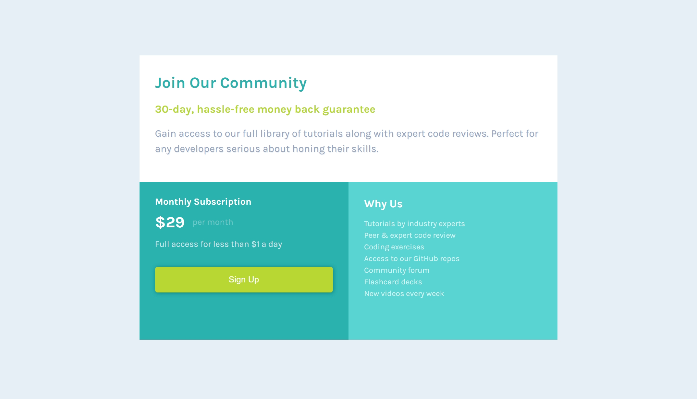

# Frontend Mentor - Single price grid component solution

This is a solution to the [Single price grid component challenge on Frontend Mentor](https://www.frontendmentor.io/challenges/single-price-grid-component-5ce41129d0ff452fec5abbbc). Frontend Mentor challenges help you improve your coding skills by building realistic projects. 

## Table of contents

- [Overview](#overview)
  - [The challenge](#the-challenge)
  - [Screenshot](#screenshot)
- [My process](#my-process)
  - [Built with](#built-with)
  - [What I learned](#what-i-learned)

## Overview

### The challenge

Users should be able to:

- View the optimal layout for the component depending on their device's screen size
- See a hover state on desktop for the Sign Up call-to-action

### Screenshot

## My process

### Built with

- Semantic HTML5 markup
- CSS custom properties
- Flexbox
- CSS Grid
- Mobile-first workflow

### What I learned

Project Description:
In this project, I developed a responsive single-price grid component using HTML and CSS. The layout promotes a subscription service with three key sections: community introduction, pricing, and features.

Responsive Design: I improved my ability to create layouts that adapt to different screen sizes using CSS grid and media queries.
CSS Grid: I learned how to effectively use CSS Grid to structure content for larger screens, ensuring a clean, modern design across all devices.

This project helped me achieve a deeper understanding of responsive web design and modern layout techniques.